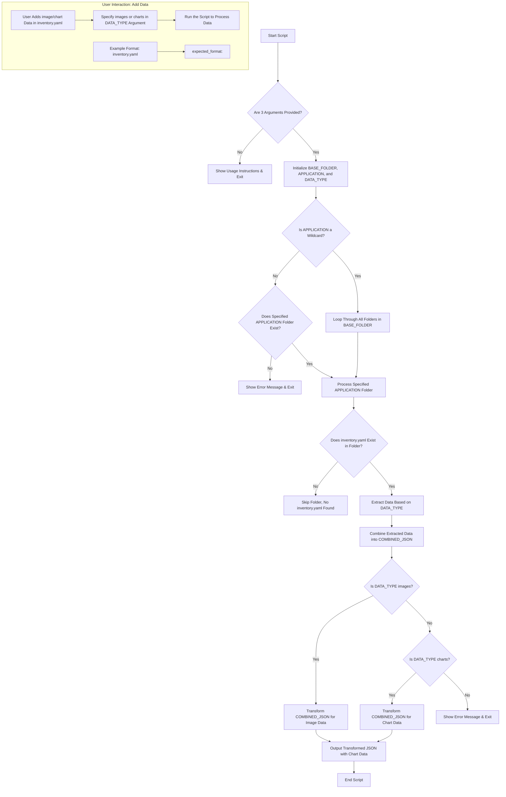

# Artifact Management - Script Flow

```mermaid
    graph TD
        A[Start Script] --> B{Are 3 Arguments Provided?}
        B -- No --> C[Show Usage Instructions & Exit]
        B -- Yes --> D[Initialize BASE_FOLDER, APPLICATION, and DATA_TYPE]

        D --> E{Is APPLICATION a Wildcard?}
        E -- Yes --> F[Loop Through All Folders in BASE_FOLDER]
        E -- No --> G{Does Specified APPLICATION Folder Exist?}

        G -- No --> H[Show Error Message & Exit]
        G -- Yes --> I[Process Specified APPLICATION Folder]

        F --> I
        I --> J{Does inventory.yaml Exist in Folder?}
        
        J -- No --> K[Skip Folder, No inventory.yaml Found]
        J -- Yes --> L[Extract Data Based on DATA_TYPE]

        L --> M[Combine Extracted Data into COMBINED_JSON]
        
        M --> N{Is DATA_TYPE images?}
        N -- Yes --> O[Transform COMBINED_JSON for Image Data]
        N -- No --> P{Is DATA_TYPE charts?}

        P -- Yes --> Q[Transform COMBINED_JSON for Chart Data]
        P -- No --> R[Show Error Message & Exit]
        
        O --> S[Output Transformed JSON with Image Data]
        Q --> S[Output Transformed JSON with Chart Data]
        S --> T[End Script]

        %% User Interaction with Example Format
        subgraph User Interaction: Add Data
            U[User Adds image/chart Data in inventory.yaml] --> V[Specify images or charts in DATA_TYPE Argument]
            V --> W[Run the Script to Process Data]
            
            X[Example Format: inventory.yaml]
            X --> Y[expected_format:]
        end
```